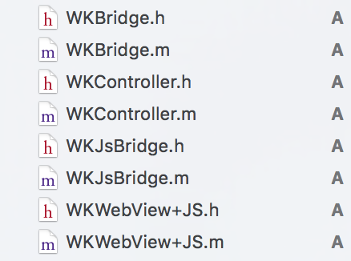

# WKBridge

一个 JavaScript - Objective-C 桥，基于 WebKit。

## 用法

### 导入源文件
将下列源文件放到项目中。



### 导入头文件：

	#import "WKController.h"

### 使用 WKController

当需要打开 H5 页面时，创建一个 WKController 对象并设置其 url：

```swift
	WKController* vc = [[WKController alloc]init];
    
    vc.url = [[NSBundle mainBundle]URLForResource:@"h5.html" withExtension:nil];
    
    [self.navigationController pushViewController:vc animated:YES];
```

### 前端 H5 页面

当需要调用到某个原生接口时，需要在 native_modules() 方法中注册相应的模块，比如：

```javascript
		<script type='text/javascript'>
            function native_modules(){
                return 'Nav,Log,Alert';
            }
		</script>
```
这表明当前页面会用到三个原生模块提供的方法。

注册完相应模块之后，就可以在 JavaScript 中调用相应的方法了，调用方式为“external.模块名.方法名(参数)”,比如：

```javascript
external.Log.log('xxxxxxx');
external.Alert.alert({'msg':'ggg','title':'5555'})

```
> 注：如果需要在页面加载后就调用某些原生方法，请将调用语句写在 iOSReady() 方法中。
### 原生模块

每个原生模块都是一个单独的 WKBridge 子类，每个子类提供相关方法的集合，每个方法提供不同的原生功能调用，每个“模块名-WKBridge子类映射”都需要添加到 WKController 的 _moduleMaps 字典属性中（请参考 WKController 的 viewDidLoad 方法中 _moduleMaps 属性的初始化代码）。

每个方法最多可以接收 0-1 个参数，这些参数形式必须是以下 4 种之一：

1. 无参（0 个参数） 
2. 1 个字典参数 
3. 1 个字符串参数 
4. 1 个数组参数

具体可参考 WKBridge 中的方法实现。

### 原生回调 JS

如果想从原生界面（ViewController）返回 JS，需要让 ViewController 实现 WKBridgeDelegate 协议，即声明两个指定的属性：

```swift
@property(copy,nonatomic)NSString* callback;
@property(weak,nonatomic)WKBridge* bridge;
```

并在初始化 ViewController 之后对着这两个属性进行初始化。具体请参考 WKBridge 中 concatenate 方法以及 ConcatenateController 的实现。


